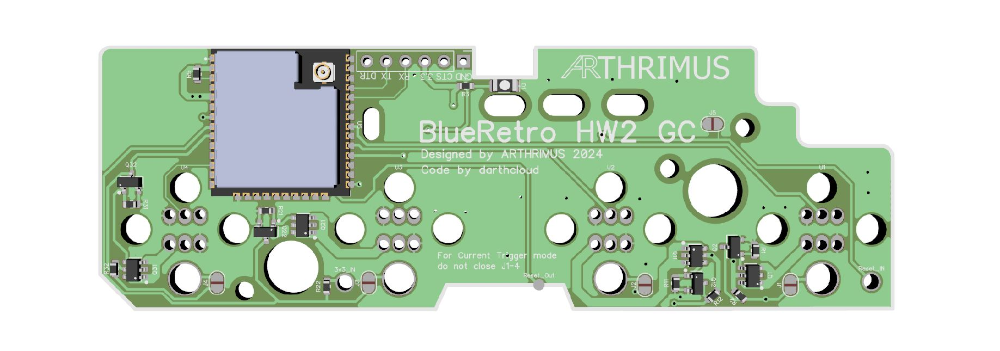
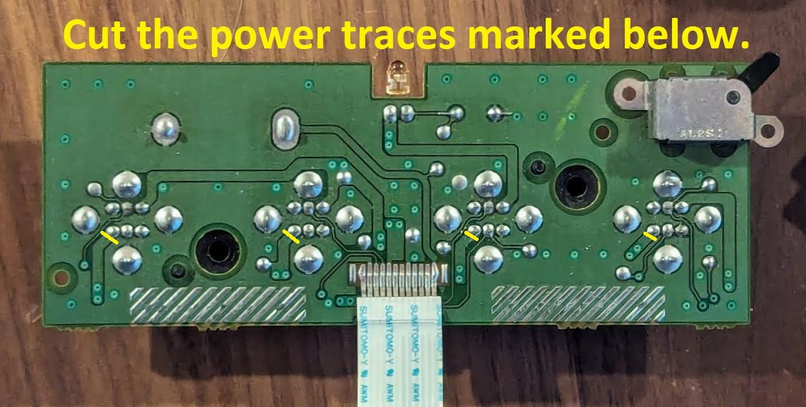
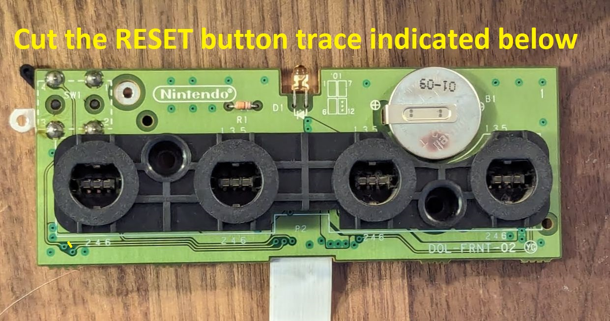

# BlueRetro HW2 QSB for GameCube

## Introdution
**Warning, this PCB design has not been validated yet. I have prototypes being manufactured currently, but they are not here yet so this design is currently untested. Proceed at your own risk.**

This is an internal QSB (Quick Solder Board) for the GameCube Cotroller Port PCB that adds BlueRetro with most of the HW2 Feature set. It is based on [Darthclouds BlueRetro](https://github.com/darthcloud/BlueRetro) and on [ManClouds Current Mirror](https://github.com/ManCloud/CurrentTrigger).

## Features

- **Internal QSB**
  
This PCB is soldered to the GameCube controller port PCB directly, without the need for any wires.

- **Port Detection**
  
  Detects if a controller is physically connected to a controller port and disables BlueRetro for that port. Port detection can be accomplished by 2 different methods.
  - **Current Trigger**
    
    Current Trigger detection requires more components to be installed but does not require as many traces to be cut on the original GameCube controller port PCB

  - **Port Shield**
    
    Port Shield detection requires less components, but requres many traces to be cut on the GameCube controller port PCB.

- **Reset Control**
  
    You can reset the console with the controller and you can change the state of the ESP with the reset button, eg. Pairing mode or resetting the ESP config.
- **Global Status LED**
  
  There is a status LED on the board that can indicate the state of the BlueRetro board. This LED is visible through the GameCube's power led light pipe.

  ## Usage

Please refer to the [BlueRetro Documentation](https://github.com/darthcloud/BlueRetro/wiki) for usage instructions.

## Building the PCB

PCBs should be manufactured at .8mm thickness.

- **Current Trigger Version**
  
  For the Current Trigger version use the [Current Trigger BOM](https://github.com/Arthrimus/BlueRetro-HW2-GameCube/blob/main/PCB/GC%20BlueRetro%20BOM%20(Current%20Trigger).xlsx). Do not close J1-J4
- **Port Shield Version**
  
  For the Port Shield version use the [Port Shield BOM.](https://github.com/Arthrimus/BlueRetro-HW2-GameCube/blob/main/PCB/GC%20BlueRetro%20BOM%20(Port%20Shield).xlsx)
  Close J1-J4. Do not populate Q1,Q11,Q21,Q31,Q2,Q12,Q22,Q32,R1,R11,R21,R31.

## Programming the ESP32

A serial port is provided next to the ESP32. J5 needs to be closed or if the PCB is already installed on the GameCube Controller PCB Reset needs to be held down while connecting the board to your serial progreammer. J5 should be opened once programming is completed.

## Installation

- **Current Trigger Version**
  
Cut 3.3v traces for each controller port as indicated in the image below.

Double check that the 3.3v pins for each controller are no longer connected to the 3.3v traces using a multimeter.

- **Port Shield Version**
  
Cut Shield Ground traces for each controller port as indicated in the image below.

Double check that the shields for each controller are no longer connected to ground using a multimeter.

- **Both Versions**
  
Cut the reset button trace on the front side of the GameCube controller PCB in the location indicated below.

Once all of the traces are cut simply lay the QSB over the pins on the back of the GameCube controller port PCB and solder all of the points on the QSB to the pins and pads that they line up with.

